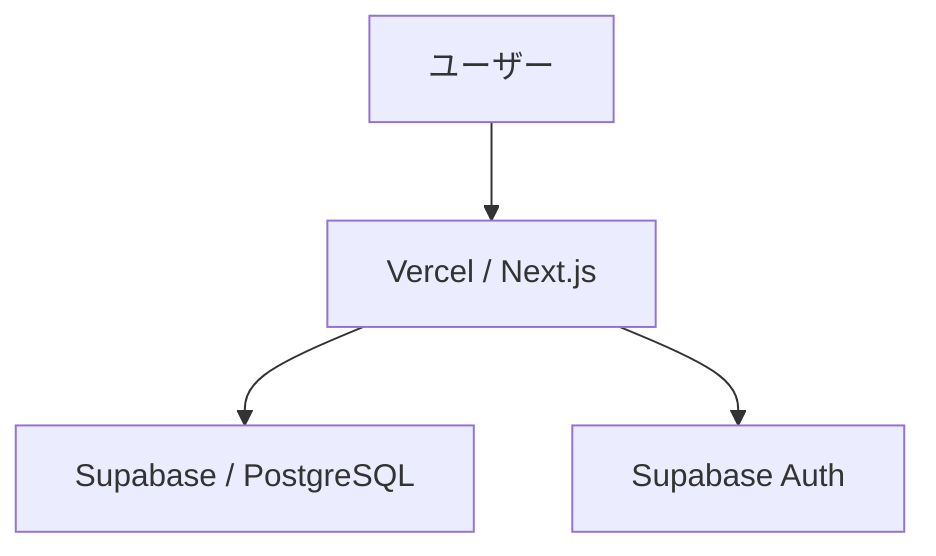

# :memo:chichi-reco (父のレコーディング)
毎日記録習慣があるアナログ派の父のために作った記録アプリです。
 

#### このサービスを作った思い
父は毎日、万歩計をつけて運動に行き、入浴前に体重を測ってノートへ記録しています。

その「ただの記録」を、グラフで可視化できたらもっと楽しく続けられるのでは？と思い、このアプリを作成しました。
 

## :memo:App URL
スマートフォンからの利用をおすすめします。
https://chichi-reco.vercel.app/
 

## :memo:chichi-recoについて
#### 対象ユーザー
・体重や歩数を手軽に記録したい人
・シンプルな記録アプリを求めている人
・日々の運動メモも残したい人

#### ユーザーの課題
・毎回たくさんの項目を入力するのが面倒
・シンプルに記録だけしたい
・筋トレ内容など、ちょっとしたメモも残したい

#### 解決方法
必要最低限の入力だけで、日々の記録を続けやすくしました。

#### プロダクト
体重または歩数のどちらかを入力するだけで、グラフやカレンダーを通して記録を可視化できるアプリです。
#### 主な機能
・前回の記録内容を今日の画面で確認可能
・任意でメモを記録可能
・カレンダー上から新規登録・編集・削除が可能
・1週間 / 1か月 / 6か月 / 1年 / 3年ごとの推移をグラフで確認可能

### 使用技術
| カテゴリ | 技術 |
| --- | --- |
| 言語 | TypeScript |
| フロントエンド | Next.js / React |
| スタイリング | Tailwind CSS |
| フォーム | React Hook Form |
| グラフ | Recharts |
| ORM | Prisma |
| 認証・DB | Supabase |

### 画面遷移図
[画面遷移図（Figma）](https://www.figma.com/design/ZdpSw4j6qeb5S2BDAUaSsb/shiftb_chapter12-%E3%82%AA%E3%83%AA%E3%82%B8%E3%83%8A%E3%83%AB%E3%82%A2%E3%83%97%E3%83%AA-%E7%88%B6%E3%83%AC%E3%82%B3?node-id=106-102&t=4AJLrz7mpUlrrFdv-0)

### ER図
[ER図](https://miro.com/app/board/uXjVImTzqIw=/)

### インフラ構成

